# ChatGPT 2025深度评测：这工具到底值不值得入手?

你可能在想：ChatGPT 是不是真的适合你个人用、工作用，或者团队用？

这篇评测，我会从实际使用者的角度，把 ChatGPT 的功能、界面、安全性、集成能力和价格都给你掰开了说清楚。

**先说结论：**

* **功能丰富度：** 8/10。ChatGPT 提供了多种 AI 模型和功能，覆盖各种使用场景，但有时回答不准确或出 bug。
* **界面和易用性：** 9/10。界面简洁得像 Google，用起来就像聊天一样自然。
* **安全措施：** 5/10。有基础的安全功能和管理后台，但容易遭遇钓鱼攻击和数据泄露。
* **集成能力：** 8/10。自定义 GPT 是个不错的方式，可以连接你常用的生产力工具。
* **团队协作：** 6/10。协作功能中规中矩，但比不上市面上的一些替代品。
* **定价模式：** 9/10。从学生到企业，总有一款适合你。

**综合评分：** 7.5/10。

---

## ChatGPT 是什么东西？

ChatGPT 是 OpenAI 开发的生成式 AI 模型，能用来写内容、做研究、编程、生成图片——用途多到数不过来。

平台提供了好几种 AI 模型，各有千秋：

* **GPT-4-Turbo** – 快速、便宜、高效的版本，推理和语言能力都很强。
* **GPT-4** – OpenAI 在 Turbo 之前最先进的模型，准确度高，理解上下文的能力深。
* **GPT-3.5** – 比 GPT-4 轻量一些，但性能不错，成本更低。
* **GPT-4o** – 最新迭代版本，在 GPT-4 的基础上扩展了能力，能处理文本、音频、图片、视频和各种文件格式。
* **GPT-4o Mini** – GPT-4o 的精简版，在性能和资源需求之间找到平衡。

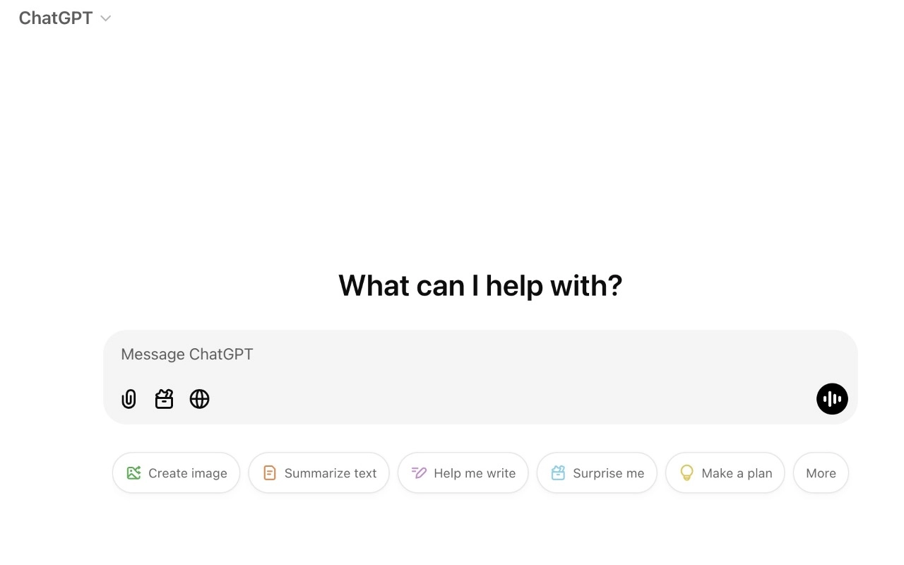

ChatGPT 适合专业和非专业需求——这让它成为研究人员、程序员、金融专家和内容营销人员的首选。

➡️ 我从 ChatGPT 刚出来就开始用了，个人和工作都在用。

💡 既然要深度评测，我会给出对 AI 平台功能、界面、安全性、集成能力和团队协作功能的客观评分。

咱们先从核心功能和使用场景说起：👇

---

## ChatGPT 的核心功能和使用场景

### 生成式 AI 平台

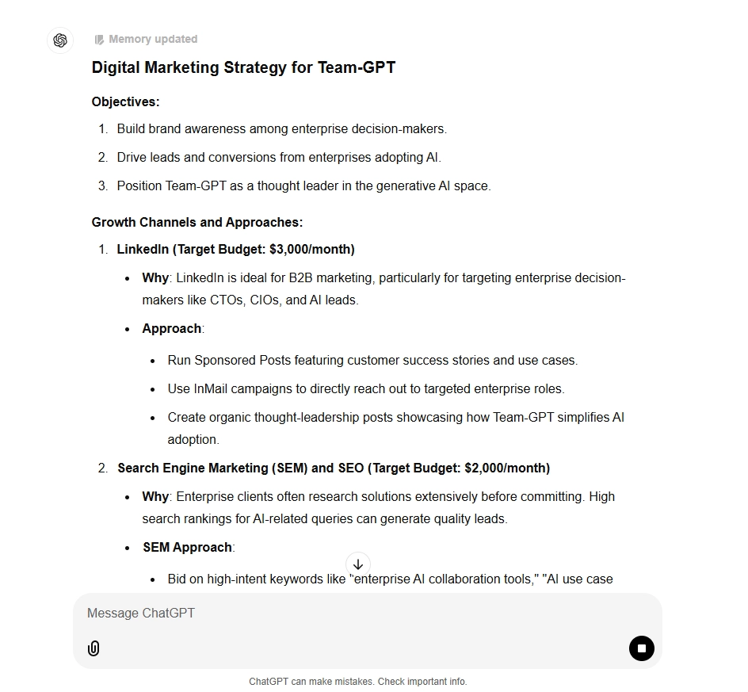

ChatGPT 让你用它先进的生成式 AI 平台来处理各种商务和非商务任务，比如：

* 生成文章和社交媒体内容
* 根据提示创建图片
* 分析大型数据集
* 总结文本和头脑风暴
* 分析图片并帮你改进写作
* 生成代码并帮你理解复杂的编程概念

➡️ 你还能查看提示历史，看到之前的对话记录。

### GPTs（自定义 AI 助手）

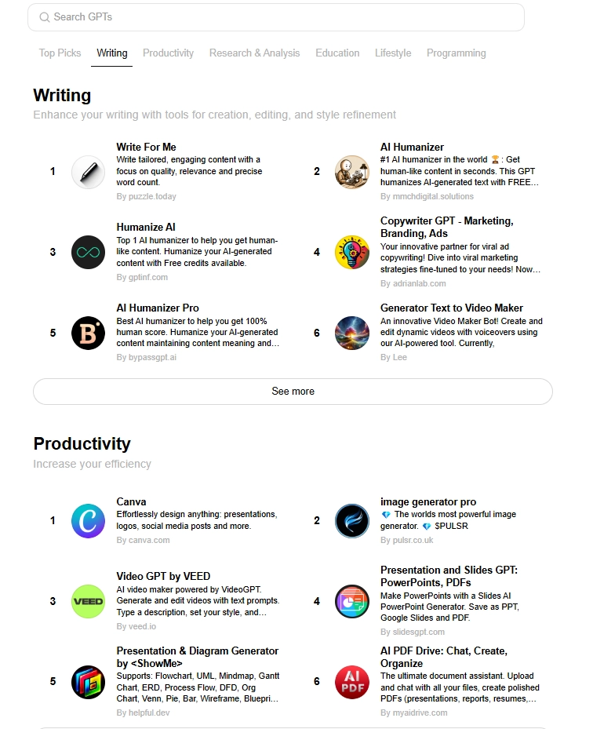

ChatGPT 让你访问它的 GPTs（即使你用的是免费版），在那里你能发现各种用途和版本的平台。

这些 GPTs 是为一系列任务而构建的，比如：

* **写作 GPTs**：用专门构建的 AI 模型来增强你的写作，创建、编辑和优化内容。
* **生产力 GPTs**：设计图片、创建视频、制作演示文稿和生成 PDF 文件。
* **研究和分析 GPTs**：总结视频、对复杂主题进行深度研究、查找数据点。

还有更多。

### 创建你自己的 GPT

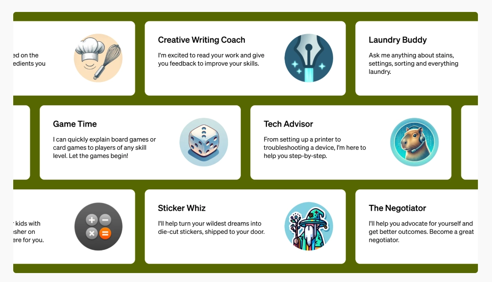

ChatGPT 让我印象最深的一点是，它让你构建自定义 GPT 并与你的团队或全世界分享。

AI 平台让你创建一个结合了自定义指令、额外知识和任何技能组合的自定义 AI 模型。

比如，你可以创建一个自定义 GPT 来为你的工作执行特定任务，或者生成符合品牌风格的图片。

如果你需要一个能帮你快速完成日常任务的智能助手，👉 [ChatGPT 会员 一个月成品号（质保30天）](https://shaoyumi.com/buy/65) 让你直接解锁 GPT-4o 和自定义 GPT 功能，无需等待，开箱即用。

### 深度研究（新功能）

ChatGPT 最近推出了深度研究功能，专为自动化复杂研究任务而设计。

AI 模型在互联网上进行深入"调查"，通过搜索、分析和综合来自文本、图片和 PDF 的数百个来源，完成通常需要你花费数小时的研究任务。

最终结果是专业级的输出，因为该工具生成的报告适用于金融、咨询和工程用例。

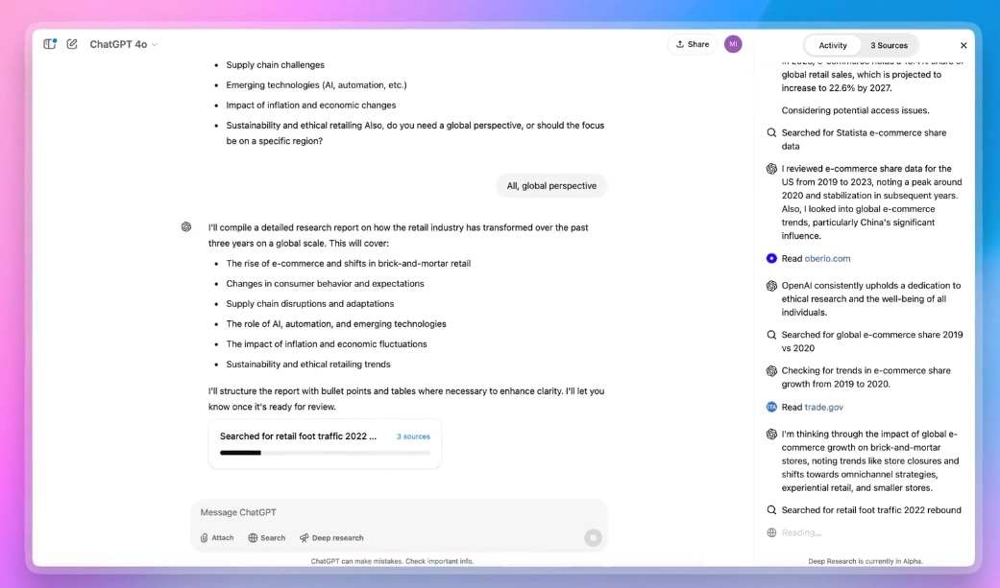

ChatGPT 凭借其高度的可训练性和先进的 AI 模型，为不同的专业人士找到了用武之地，包括：

#### 内容营销人员和 SEO 专家

* 生成文章内容并训练自定义 GPT 像你一样写作
* 用 DALL-E 生成图片
* 生成社交媒体和广告文案

#### 咨询顾问

* 顾问可以使用 AI 工具自动化市场研究，生成行业趋势报告、竞争对手分析和 SWOT 框架
* 起草客户提案/演示文稿，包括定制的谈话要点、幻灯片内容和数据可视化
* 模拟谈判场景，完善客户沟通策略和风险缓解计划

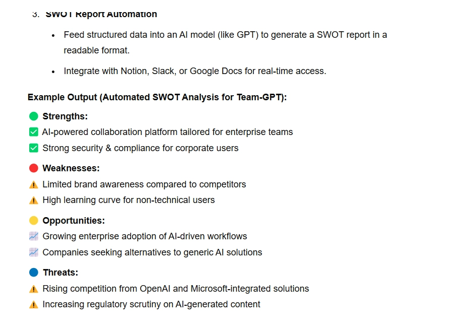

#### 研究与写作

* 研究人员可以使用 AI 工具来头脑风暴论文主题并生成包含文献综述部分的结构化大纲
* 为特定假设识别可信来源，并以多种格式自动生成引用
* 校对技术文档以提高清晰度、修复语法错误并简化行话

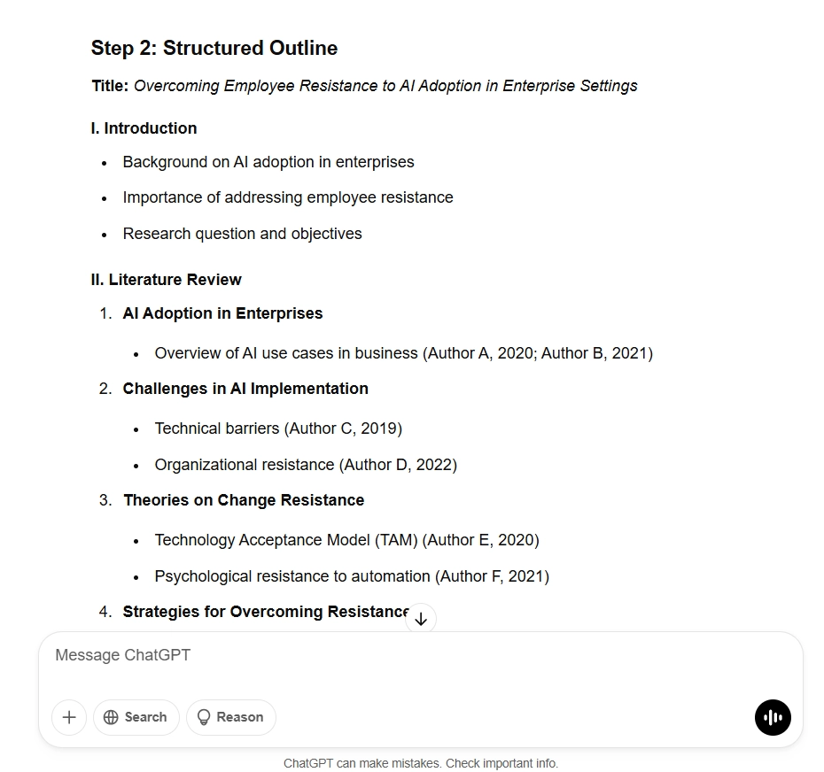

#### 金融与会计

* 金融专家可以使用 AI 工具自动化财务报告，生成现金流摘要、资产负债表和审计叙述
* 为收入预测、成本优化和投资风险分析建模预测场景
* 起草监管文件和利益相关者沟通的合规文档

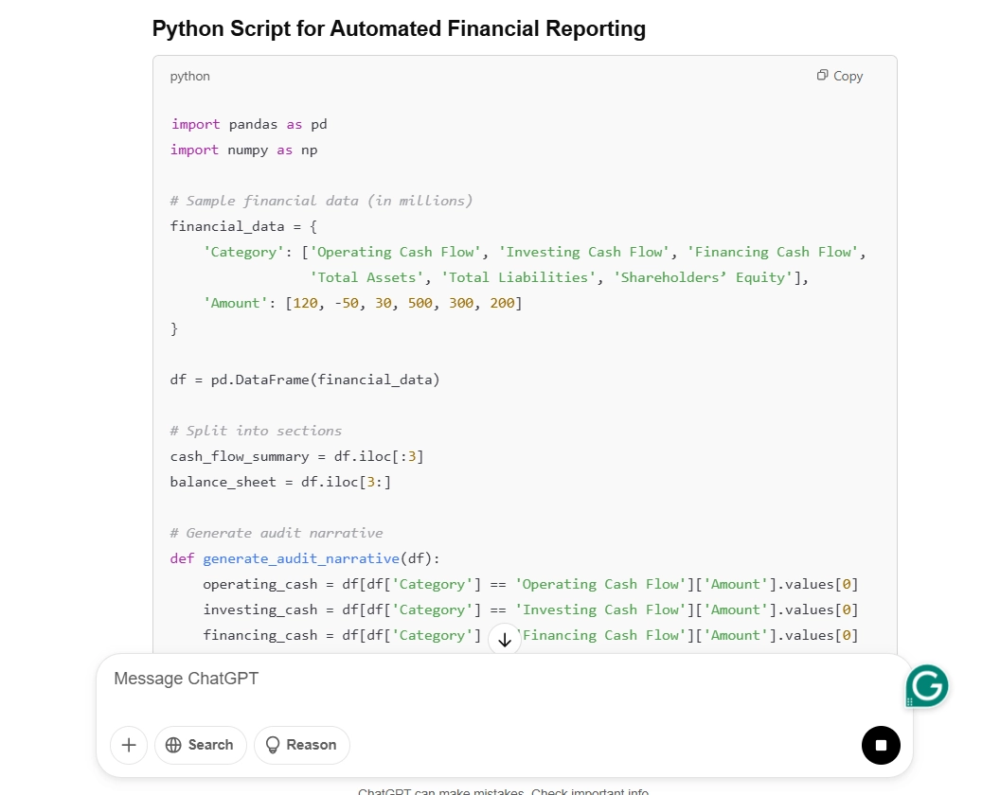

#### 数据分析

* 数据分析师可以使用 AI 工具清理/转换数据集，生成用于缺失值插补和异常值检测的 Python/R 代码
* 通过自动化相关性分析和统计模式识别发现隐藏的洞察
* 为仪表板和报告创建带有注释图表描述的可视化原型

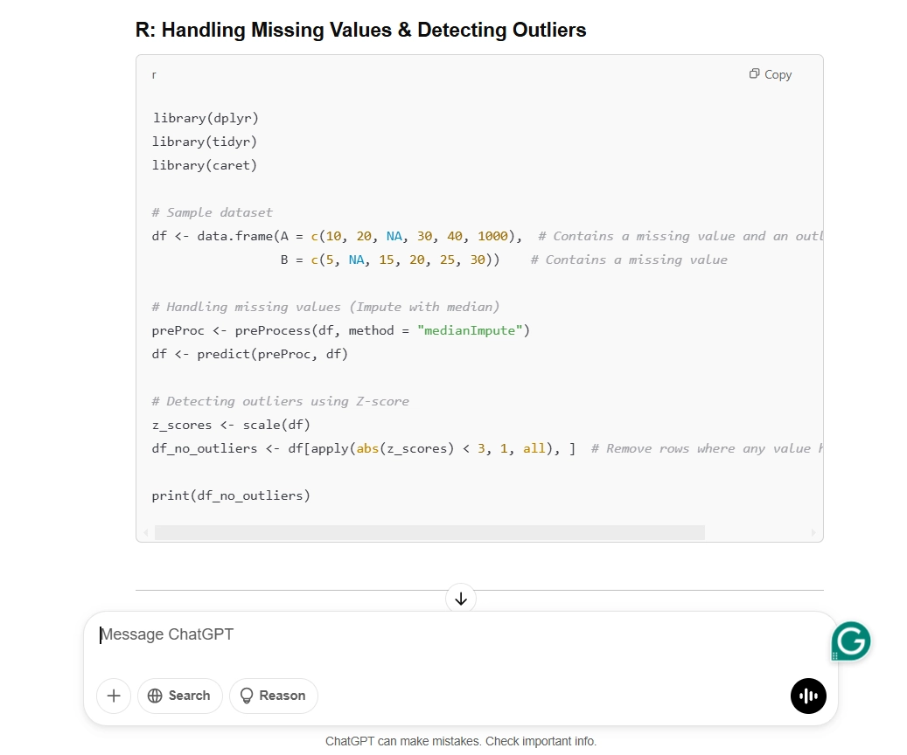

**评分：** 8/10。

ChatGPT 是一个提供许多用例、自定义选项和功能的 AI 平台，可以为你的运营工作流程提供动力。

G2 上的其他评论者也和我有同样的看法，指出该平台对他们的组织有多大帮助。

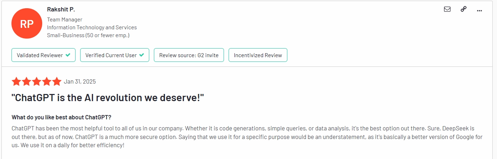

*"ChatGPT 一直是我们公司所有人最有用的工具。无论是代码生成、简单查询还是数据分析，它都是最好的选择。当然，DeepSeek 也在那里，但截至目前，ChatGPT 是一个更安全的选择。说我们将它用于特定目的是轻描淡写，因为它基本上是我们更好的 Google 版本。我们每天都在使用它以提高效率！" – G2 评论。*

我之所以给它打 8 分而不是 9 分，是因为该平台有它的 bug。

有时，如果你问工具一个复杂的问题或提示它搜索难以找到的信息，ChatGPT 就会崩溃并拒绝给你答案。

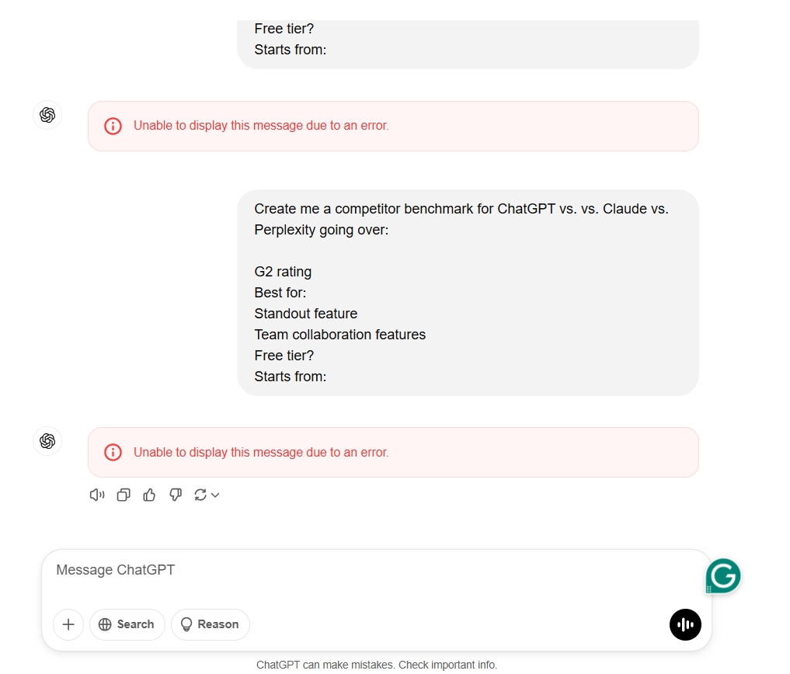

---

## ChatGPT 的界面：好用吗？

ChatGPT 提供了一个类似空白画布的界面，你可以在那里给 ChatGPT 发消息——让我想起了 Google 的简洁性。

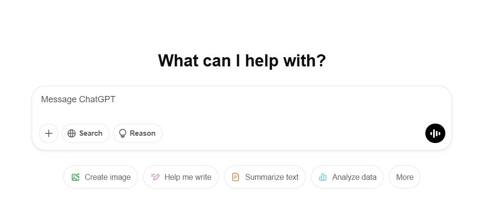

你之前的所有提示都放在屏幕左侧，带有讨论内容的摘要标题。

至于 ChatGPT 的 GPT 画廊，很容易找到并选择你想要提示的 GPT，然后点击"聊天"。

**评分：** 9/10。

ChatGPT 为其用户提供了一个干净的类似 Google 的界面，使开始使用 AI 平台及其不同模型变得容易。

该平台的用户也欣赏 ChatGPT 的易用性，指出使用该工具感觉就像发短信。

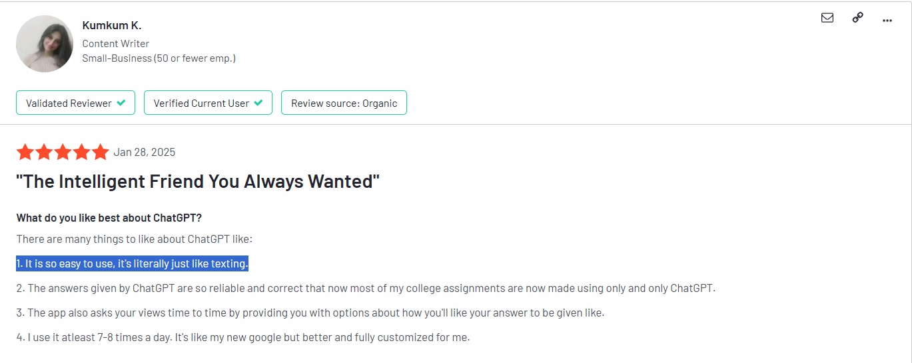

*"它非常容易使用，就像发短信一样。" – G2 评论。*

---

## ChatGPT 的安全措施

ChatGPT 为其 Pro 和 Enterprise 用户提供高级安全措施，包括：

* **数据所有权和保留控制：** 你的公司将能够保留输入和输出的完全所有权，管理员可以设置自定义数据保留期限。
* **军用级加密：** ChatGPT 内的所有数据在静态时使用 AES-256 加密，在传输时使用 TLS 1.2+，符合 SOC 2 Type 1 合规性。
* **细粒度访问控制，**包括用于企业身份验证的基于 SAML 的 SSO、用于限制访问的域验证以及用于功能或数据的基于角色的权限。

➡️ 尽管如此，第三方集成和自定义配置中存在一些漏洞，包括：

* **配置错误的 GPTs：** 具有外部 API 访问权限的自定义 GPTs 有泄露专有数据或启用钓鱼活动的风险。
* **内存操纵攻击：** 你的工作区可能面临"SpAIware"注入的风险，这些注入将 ChatGPT 变成持久间谍软件，跨会话窃取数据。
* **数据泄露：** 该平台可能通过响应暴露个人信息或关键公司信息，可能会将此类数据用于训练目的。

我还记得 2023 年 4 月的三星 ChatGPT 泄漏事件，当时三星的 3 名员工向 ChatGPT 提供了关键业务信息，如源代码和会议记录以提高生产力——结果却导致公司的知识产权面临风险。

**评分：** 5/10。

尽管 ChatGPT 有合规性和安全控制，但该平台仍然缺乏自主威胁响应和实时网络行为分析，以确保你的数据保持安全。

💡 ChatGPT 也不提供在你的场所托管平台的选项，这与 Team-GPT（就是我们）所做的类似，以增强安全措施并确保数据控制。

---

## ChatGPT 的团队协作能力

ChatGPT 通过其 Team 和 Enterprise 计划为希望在整个组织中采用 AI 的公司提供协作功能。

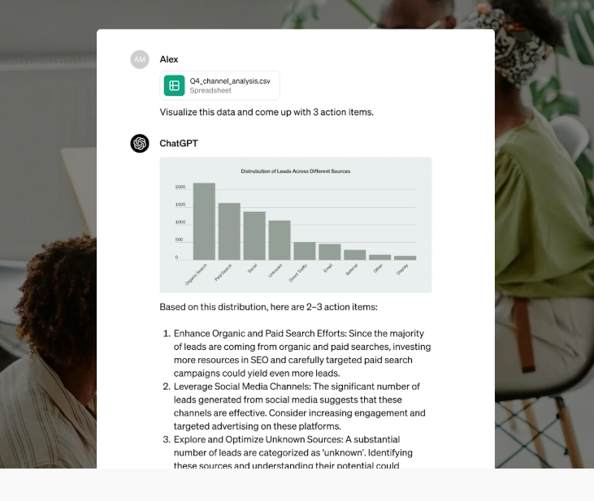

你的组织可以访问具有 32K 上下文窗口的 ChatGPT-4，并获得更高消息上限的 AI 平台，例如：

* DALL-E 3
* Vision
* Browsing
* 高级数据分析
* 深度研究

你可以创建并与团队共享自定义 GPT，并为商业目的构建平台的自定义版本。

此外，该平台让你可以访问用于工作区和团队管理的管理控制台，以及提前访问新功能和改进。

在 ChatGPT Enterprise 中，你还可以访问综合分析仪表板、组权限以及访问该工具的合规 API。

**评分：** 6/10。

ChatGPT 提供了良好的团队协作能力，可以帮助你与团队和组织中的其他部门一起工作。

尽管如此，当 ChatGPT 与 Team-GPT 的协作功能相比时，ChatGPT 的 Enterprise 解决方案不提供：

❌ 工作区内的共享聊天。

❌ 自定义提示库。

❌ 文件夹和组织结构。

❌ 对 GPT-4 和 GPT-4 Turbo 的无限访问，不像 Team-GPT。

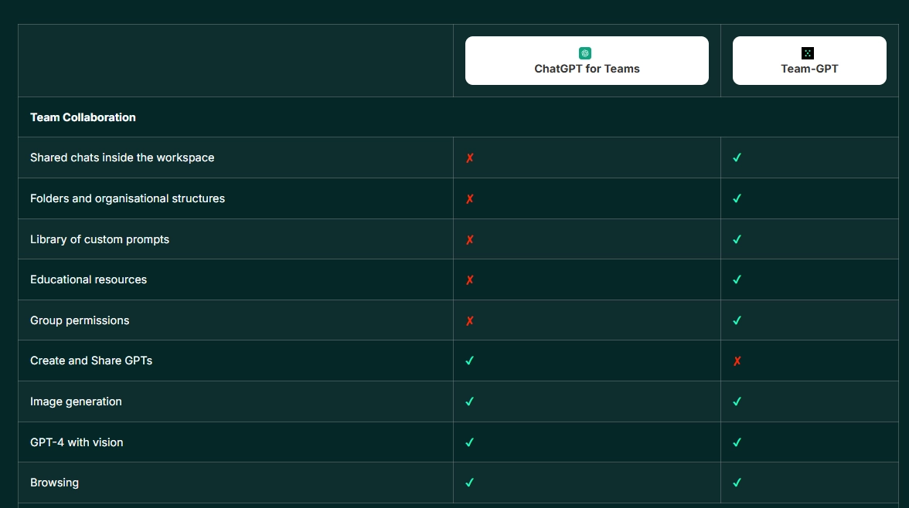

---

## ChatGPT 的集成（插件）

ChatGPT 的集成（插件）是旨在扩展 LLM 功能的工具，通过提供对最新信息的访问、集成第三方服务以及使用该平台运行更好的计算。

该平台为代码执行、图像生成和第三方应用程序（如 Zapier 和 Wolfram Alpha）引入了插件。

原始插件系统可能不太广泛可用，但该平台让你访问其自定义 GPT，其中一些连接到其他生产力平台。

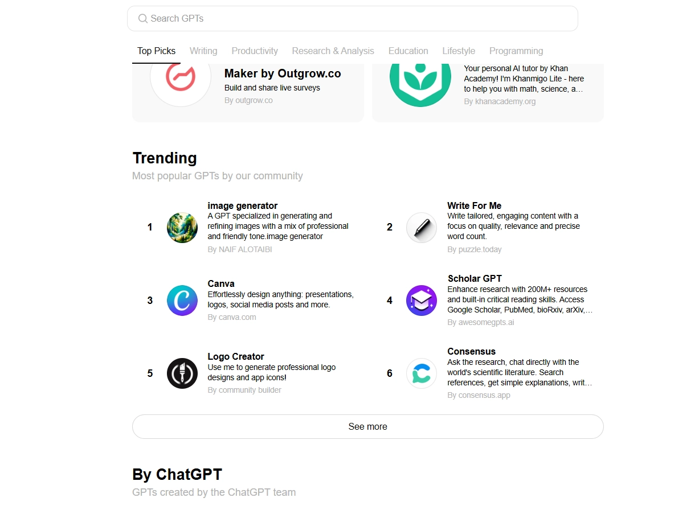

你可以在 ChatGPT 的"探索 GPTs"中找到各种集成。

例如，ChatGPT 提供了一个与 Canva 的插件，让我可以提示 Canva 创建 Instagram 帖子或其他创意材料。

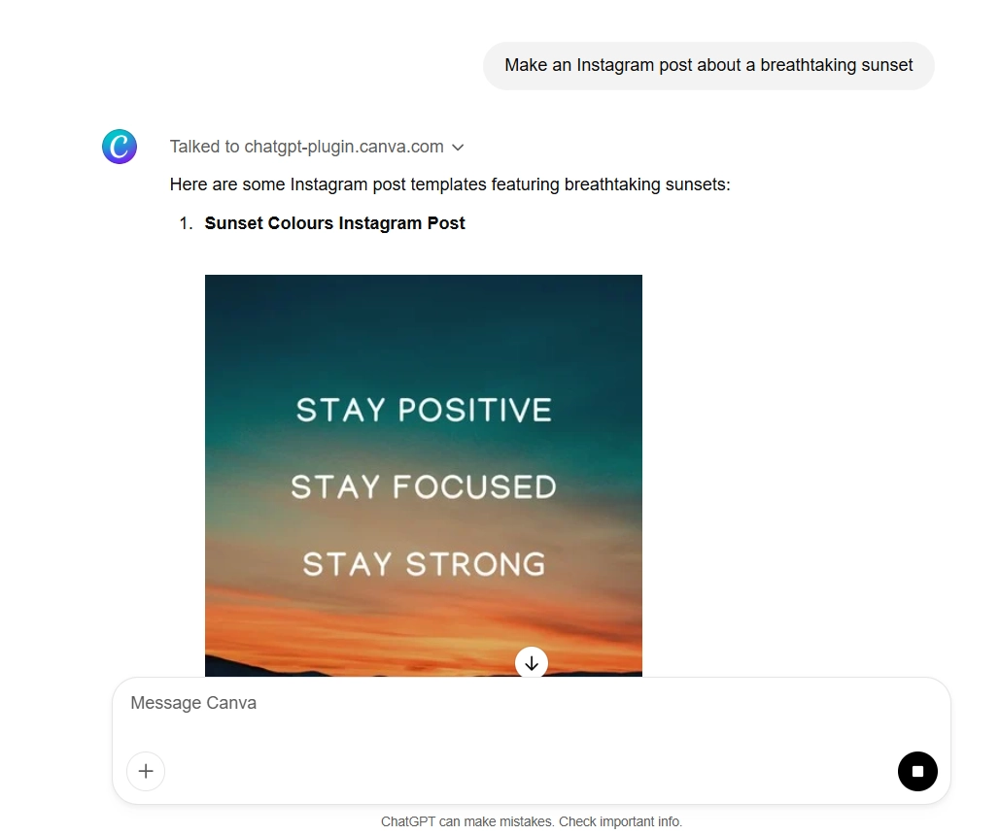

**评分：** 8/10。

ChatGPT 提供了令人满意数量的插件和与你的团队可能已经在使用的其他生产力应用程序的集成。

事实上，如果你所有用于图像生成或数据分析的生产力应用程序都位于 ChatGPT 的自定义 GPT 市场中，你就不必离开该平台。

该平台的客户似乎也对该平台的集成感到满意。

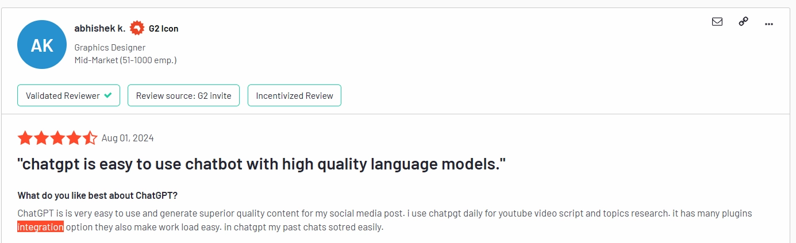

*"ChatGPT 非常容易使用，并为我的社交媒体帖子生成高质量的内容。我每天使用
